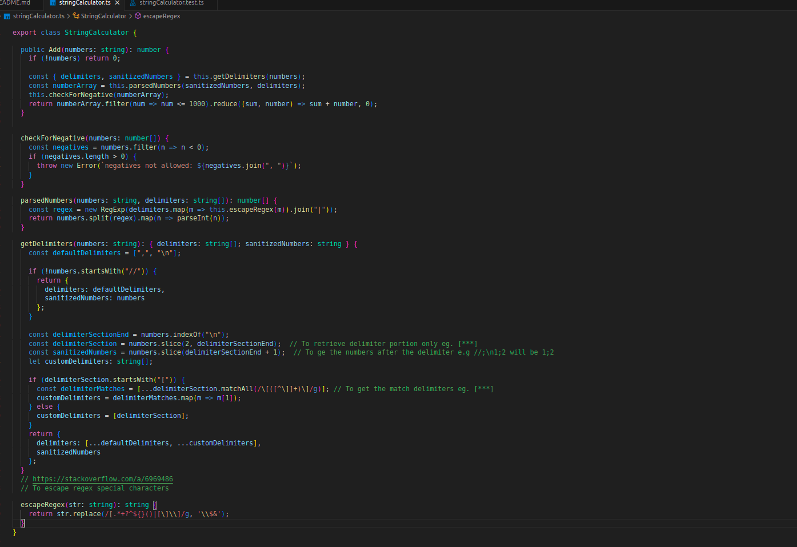
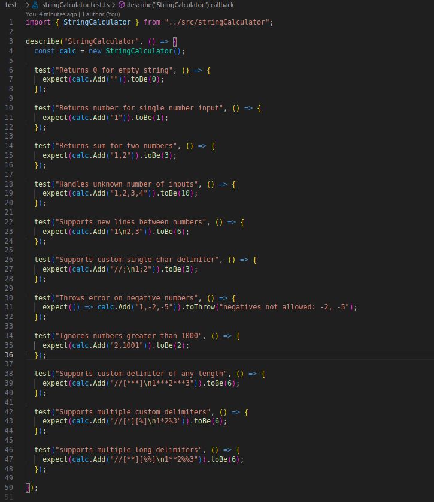
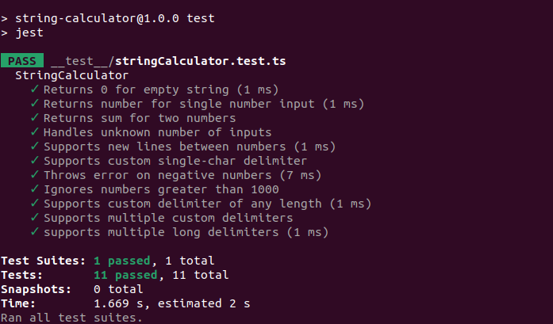

## String Calculator

String Calculator function to take string of number and return addition of those numbers

## Installation

To use this project, first clone the repository and install dependencies:

```sh
git clone https://github.com/RajanTank/string-calculator.git
cd string-calculator
npm install
```

## RUN

To run the test please run the command

```sh
npm test
```

# Screenshots


-----------


-----------


